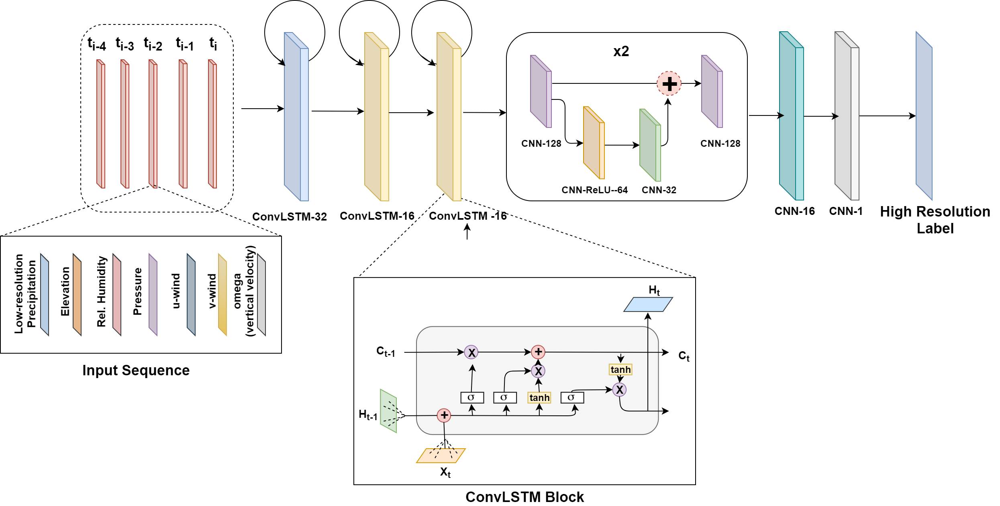

# Augmented Convolutional LSTMs for Generation of High-Resolution Climate Change Projections

The code in this repository contains the implementation of a novel Statistical Downscaling approach using an Augmented Convolutional LSTM based architecture.

Paper: https://ieeexplore.ieee.org/document/9348885

## Augmented Conv LSTM Architecture 



## Dependencies

The current codebase is entirely written in Python3. 
* Tensorflow (recommended =1.13)
* Xarray is recommended for processing Climate data. For more details, see [here](http://xarray.pydata.org/en/stable/).


## Data

* The coarse resolution precipitation outputs used, can be downloaded from NCAR Community Earth System Model available in the archives of the [Climate Modeling Intercomparison Project](https://esgf-node.llnl.gov/projects/cmip5/). 
* For topographical elevation information of India, we have used data from NASA’s [Shuttle Radar Topography Mission (SRTM)](https://www2.jpl.nasa.gov/srtm/), which is available at 90 meters resolution.


## Usage

>Place all the downloaded data mentioned in the above section in the form of `numpy nd-arrays` in their respective folders nested inside the `./data` directory.


### Quick Look

Download a sample climate data from [here](https://drive.google.com/file/d/1ca9su8Xl-cxLuyjSCf5o9QidFj6eoOKZ/view?usp=sharing) which consists of 20 consecutive days including all the 7 climatic variables. 

Also, Download the weights of a pre-trained model that has been trained for 500 epochs on monsoon period on India from [here](https://drive.google.com/file/d/1xypEkTLXBGYg2JSmVH-7kVATrPgOLxi1/view?usp=sharing). Place all the files inside `./sample_data` directory. Then run the following:

```shell
$ python sample_test.py  
```


### Configuration File

`config.ini` provides configuration allowing setting options such file directories, model parameters, and data specification required for the preprocessing of climatic variables in `preprocess_data.py` and model training in `model.py` and `train.py`. 


### Train File Usage:

After placing all the climate variables in their respective folders.

```shell
$ python preprocess_data.py
$ python train.py [--mode] [--model_type] [--batch_size] [--use_gpu]
```

1. **--mode** = `train \ test`

2. **--model_type** = `monsoon \ non_monsoon`

3. **--batch_size** = `int (default: 15)`

4. **--use_gpu** = `bool (default: False)`


